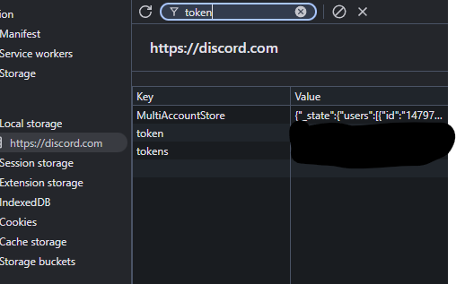

# Hypesquadify
Allows you to get the HypeSquad badges.

# How to use
- Download the .NET 10 SDK and compile this app (I was impatient on the file upload)
- Follow the instructions. To get your Discord Token, <a href="#how-do-i-get-my-discord-token">click here</a>.
- You're pretty much done.

# How do I get my Discord token?
- Open Discord in your browser and log in.
- Open DevTools (by hitting F12) and go to the `Application` tab.
- Go to Local Storage -> `https://discord.com` and search for "token", this image should help:
 
- Click on the `token` entry and copy the contents of it. (Make sure to get rid of any quote symbols!)

# Why not just use the Discord app and answer some questions?
Because you can't. Discord discontinued HypeSquad, meaning that the tab thingy is gone as well. 
What isn't gone though is the **API endpoint** for it. Which is also why this requires your Discord token.

# I don't wanna give my Discord token.
Don't worry! I don't give it to anyone except Discord, which *already has it*.